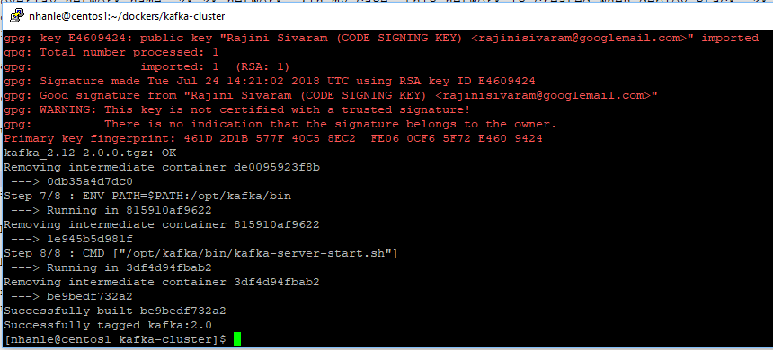
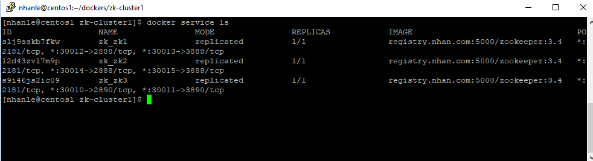
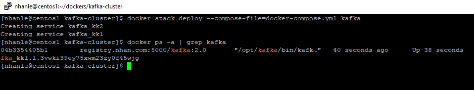
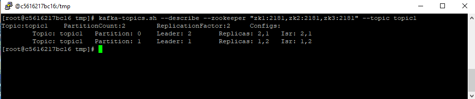
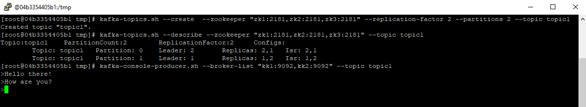
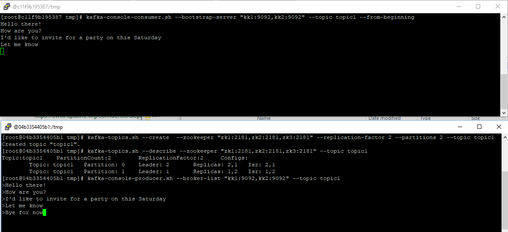
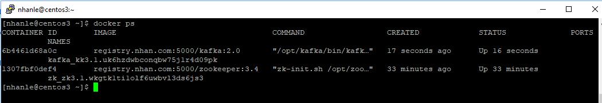
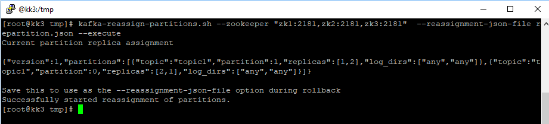
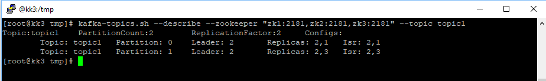

# Create a Kafka Cluster 

### Prerequisite
	- A Zoo keeper cluster which has 3 nodes ( with 3 nodes we can afford to have 1 failed node)
	- A overlay network name "zk_zk_network" (in my case, this network is created when deploy stack "zk"). Now Kafka nodes will join this network to use the ZK cluster (we dont have to run standlone ZK)
	- A registry is up and running (in my case it is registry.nhan.com:5000)	

### Prepare the Kafka image

Run the command to build and tag the image as "2.0"
```
docker build --force-rm -t kafka:2.0 .

``` 



Tag it and push to the registry so that all the Swarm nodes can pull and run the image
```
docker tag kafka:2.0 registry.nhan.com:5000/kafka:2.0
docker push registry.nhan.com:5000/kafka:2.0
```

First check to ensure that ZK cluster is runing.



Now deploy "kafka" stack. Refer to the file "docker-compose.yml" and guess :)
Initially, I have only two service kk1 deployed on sever centos1 ( Swarm Manager), and kk2 on centos2 (Worker node)

```
	docker stack deploy --compose-file=docker-compose.yml kafka
```


### Create test topic 

Run inside the kk1 container ( actually this can be run on any nodes on the network "zk_zk_network"

```
	docker exec -it <containterid> /bin/bash
```

Let create topic 1 (note that when we build the Kafka image, we update the PATH environment to include /opt/kafka/bin already)
Also the three Zookeeper instance host names are zk1, zk2, zk3

```
kafka-topics.sh --create  --zookeeper "zk1:2181,zk2:2181,zk3:2181" --replication-factor 2 --partitions 2 --topic topic1
```


Describe it to see more information

```
kafka-topics.sh --describe --zookeeper "zk1:2181,zk2:2181,zk3:2181" --topic topic1
```



```
kafka-console-producer.sh --broker-list "kk1:9092,kk2:9092" --topic topic1
```


Now let connect the the Kafka container on centos2 and test consumer

```
kafka-console-consumer.sh --bootstrap-server "kk1:9092,kk2:9092" --topic topic1 --from-beginning
```


Notice that as soon as we press enter on the producer , the message instantly appears in the consumer screen

### Scale up 1 node

Now let scale up one instance that is kk3 run on the centos3 Docker host (refer to docker-compose-2.yml for detail)

```
	docker stack deploy --compose-file=docker-compose-2.yml kafka
```

Note that "docker stack deploy" is used for updating the stack as well. In the "docker-compose-2.yml", we describe only the kk3 instance
docker will deloy the new service "kk3" and let the other two kk1 and kk2 running. This is what we want right?!

Check the new service kk3 deployed on centos3 server



### Reassign the partion replications
Let move on replication of partition 1 to the new server centos3
 
Use vi command to create a json file which has informatin for partition reassignment-json-file

```
{"partitions":
 [{"topic": "topic1",
   "partition": 1,
   "replicas": [2,3]
 }],
"version": 1
}
```

And 

```
kafka-reassign-partitions.sh --zookeeper "zk1:2181,zk2:2181,zk3:2181"  --reassignment-json-file repartition.json --execute
```


Let describe the topic1 again



Recall that "kk1" is on "centos1" with broker id ="1", same rule for the other 2 instance
Look into the result That is what we expected!


